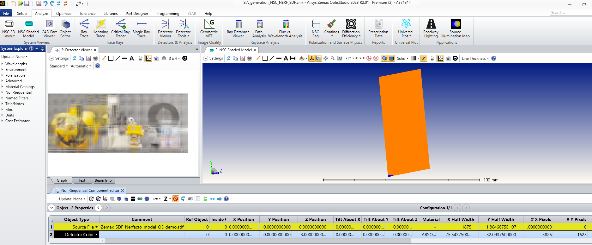

Here we present the Zemax simuation used to generate the elemental images corresponding to ray data from the ray generation simulation and the nerfacto model. The simulation layout below, composed of only two objects, gives an overview of its simplicity. A light source model (.SDF) is also attached here to generate the EIA.
To use the provided SDF, please do not forggot to place it in the approriate folder: "\Zemax\Objects\Sources\Source Files".

## Results

User just have to open an "Dectector Viewer" and launch the "Ray Trace" feature ("Clear & Trace" button) to form the EIA.

