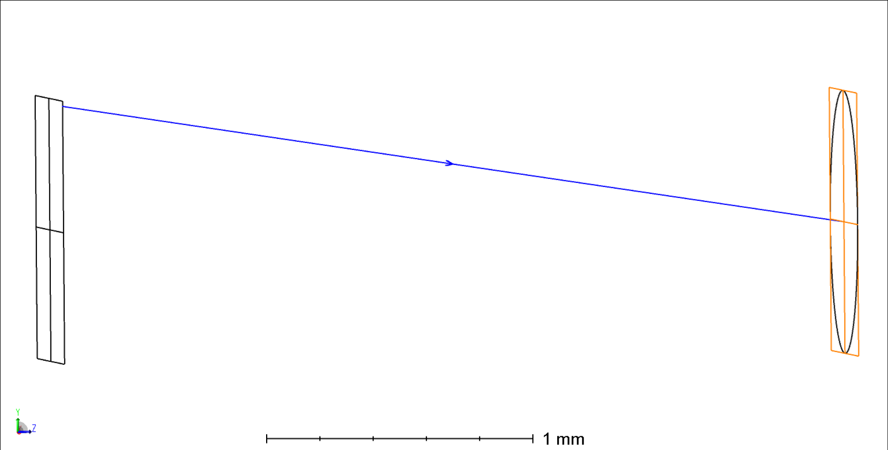

Here is the Zemax optical system used to generate the rays for the lenslet array. The lens layout below shows how simple it is (composed of two parrel planar surfaces). A ZPL macro is also attached here to obtain the ray file format used in this project as an input.

