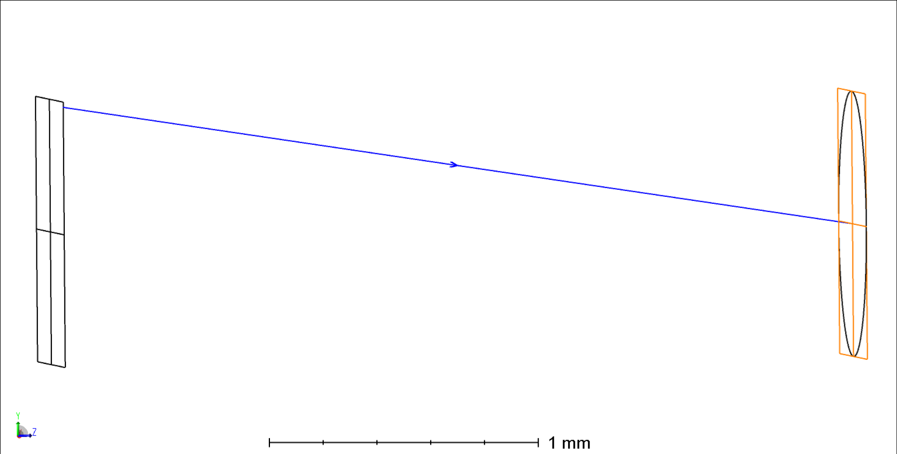

Here is the Zemax optical system used to generate the rays for the lenslet array. The lens layout below shows how simple it is (composed of two parrel planar surfaces). A ZPL macro is also attached here to obtain the ray file format used in this project as an input.



The ZPL macro produce a text file with the following nomenclature:

``` pos
x, y, z, l, m, n
```

where x, y, z and l, m, n denote respectively the position and direction cosines of a single ray in the pupil plane of the associated microlens.
For an elemental image containing N x N pixels, the text file returns N x N lines of ray data.
The code provided allows the computed ray data to be extended to a user-defined number of EIs.
The generated text file will be used during the query phase of the NeRF-related model.
